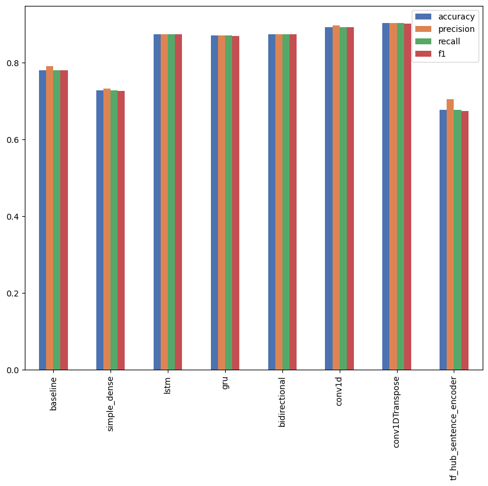

# **ChatGPT App Reviews - Sentiment Analysis**

## **Dataset**

Dataset can be accessed and downloaded from Kaggle platfrom: [ChatGPT App Reviews](https://www.kaggle.com/datasets/saloni1712/chatgpt-app-reviews)

The ChatGPT App Reviews dataset is a comprehensive collection of user reviews from the ChatGPT mobile app on iOS, capturing valuable insights and sentiments. The dataset enables the understanding of user satisfaction, evaluation of app performance, and identification of emerging patterns.

Preprocessing steps were used to clean the text data, such as converting words to lowercase, deleting punctuation and emojis, removing stop words, and performing lemmatization to reduce words to their base form.

Word clouds are also generated to visualize the most common words associated with positive, neutral, and negative sentiments. These word clouds demonstrate a fast overview of the frequently expressed sentiments in the reviews.

Random oversampling was used in order to tackle the issue of imbalanced data, this approach involves randomly duplicating examples from the minority class and adding them to the training dataset.

**Dataset Word Cloud**

## **Models**

In this project, the following series of models/architectures will be applied, we'll then compare the results of each model and see which one performed best:

 

- Model 0: Naive Bayes - Baseline
- Model 1: Feed-Forward Neural Network (FNN)
- Model 2: Long Short-Term Memory (LSTM)
- Model 3: Gated Recurrent Unit (GRU)
- Model 4: Bidirectional-LSTM (BiLSTM)
- Model 5: 1D Convolutional Neural Network (Conv1D)
- Model 6: TensorFlow Hub Pretrained Feature Extractor

 

## **Performance Evaluation**

The model demonstrating the highest performance was identified as Conv1D, attained an accuracy score of 90.94% along with an f1-score of 0.91 and above for all label categories (positive, neutral, and negative). This model shows the ability to precisely predict labels based on the ChatGPT iOS reviews.

With the developed sentiment analysis model, we can successfully analyze and comprehend the sentiments conveyed in ChatGPT reviews. This provides valuable insights for businesses, helping them make invaluable conclusions, enhance customer satisfaction, and their products and services based on customer feedback.

**Comparing the Performance of Models**

